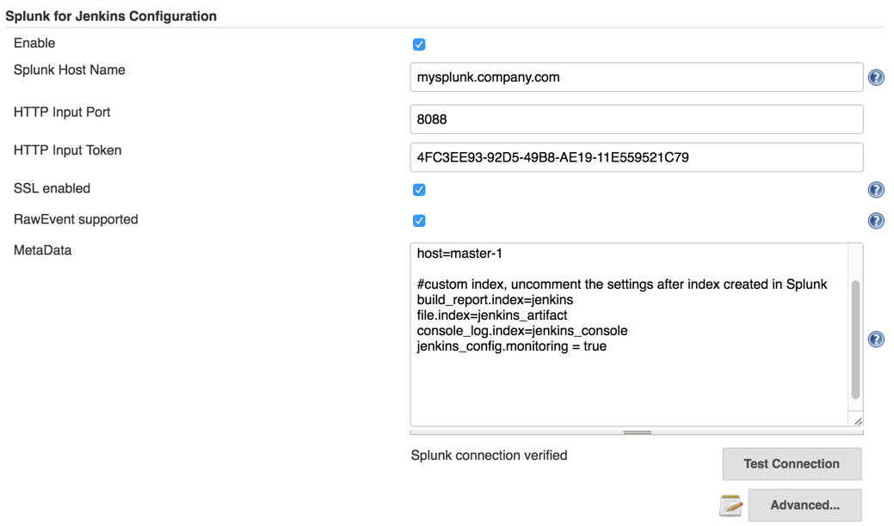
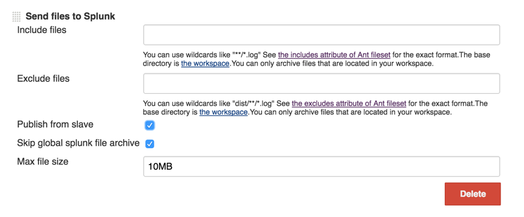

Splunk for Jenkins
---------

To Install
----
 - clone the repo
 - `$ cd splunkjenkins`
 - `$ mvn package`
 -  That should produce `target/splunkjenkins.hpi` which you can install into Jenkins with either the web interface or by putting it in the `JENKINS_HOME/plugins` folder.
 - `$ mvn clean verify -Dsplunk-token-setup=true -Dsplunk-host=localhost -Dsplunk-username=admin -Dsplunk-passwd=changeme` to run tests against splunk instance 


To Setup
----
### Configure plugin

 - Go to https://<jenkins-url>/configure
 - Enter Hostname, Port, and Token
 - Enable RawEvent support if you are using Splunk version 6.3.1511 or later
 - Click "Test Connection" to verify the config
 - Enable it and Save
 
   

### Customize Job Data Sent to Splunk

#### Customize post job processing

- In the advance configure section, you can customize the post data using groovy DSL
- ``send(Object message)`` will send the information to splunk
- ``AbstractBuild build``, ``Map env`` can be used directly. Variable env is a Map of Environment variables, build is hudson.model.AbstractBuild
- `getBuildEvent()` will return metadata about the build, such as build result, build URL, user who triggered the build
- `getJunitReport(int pageSize)` will return a list of test results, which contains total, passes, failures, skips, time and testcase of type List<hudson.tasks.junit.CaseResult>
- `getJunitReport()` is an alias of `getJunitReport(Integer.MAX_VALUE)[0]`
- `archive(String includes, String excludes, boolean uploadFromSlave, String fileSizeLimit)` send log file to splunk
- `archive(String includes)` is an alias of `archive(includes, null, false, "")`
- `getAction(Class type)` is an alias of ` build.getAction(type)`
- `getActionByClassName(String className)` same as `getAction(Class type)` but no need to import the class before use
- `hasPublisherName(String className)` check whether the publisher is configured for the build (applied to AbstractBuild only)
- Sample code

```java
	//send job metadata and junit reports with page size set to 100 (each event contains max 100 test cases)
	def results = getJunitReport(50)
	def buildEvent = getBuildEvent()
	results.eachWithIndex { junitResult, idx ->
	    Map pagedEvent = buildEvent + ["testsuite": junitResult, "page_num": idx + 1]
	    send(pagedEvent)
	}
	//send all logs from workspace to splunk, with each file size limits to 10MB
	archive("**/*.log", null,false,"10MB")
```

#### Customize log files at job level
- Add a "post-build action" called "Send data to Splunk"
- Enter an ant-style pattern matching string for your junit xml collection
  
 
Dashboard
----

you can get the "Splunk App for Jenkins version" App from [splunk base](https://splunkbase.splunk.com/)
and configure the plugin to use below metadata TODO:update link

	source=jenkins
	host=your-host-name
	index=jenkins_statistics
	build_report.index=jenkins
	file.index=jenkins_artifact
	console_log.index=jenkins_console
	
you can also let the plugin to monitor Jenkins config changes (jobs, plugins etc.)

	jenkins_config.monitoring=true

